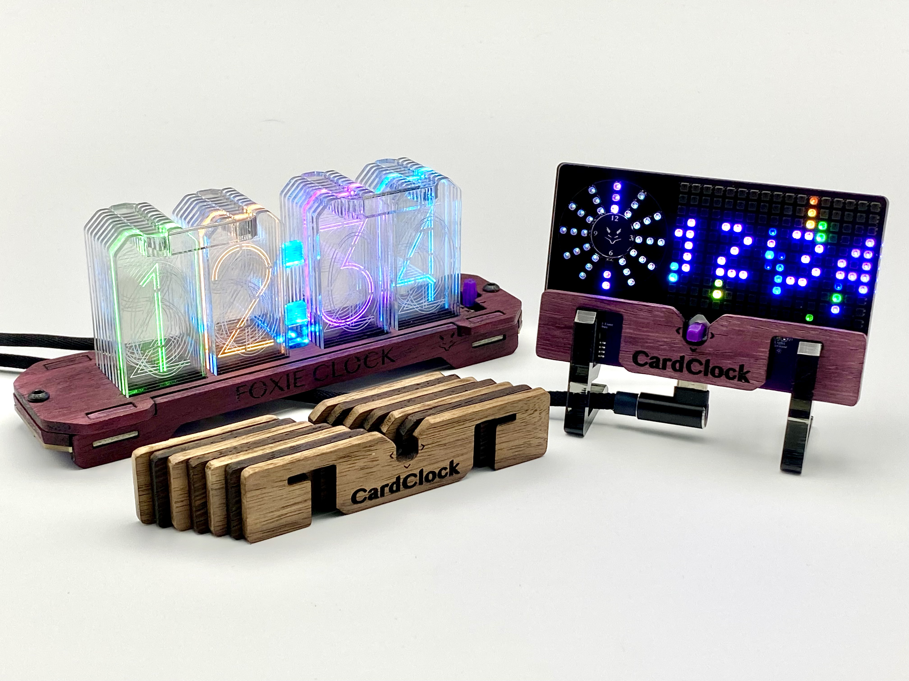

# FCOS - Foxie Clock Operating System
This is the firmware that runs the [Foxie Clock 2.0](https://github.com/foxieproducts/fc2) and the [CardClock 2.0](https://github.com/foxieproducts/cardclock2).



## How do I use it? 
Foxie Clocks can be in 3 different display modes: Clock, Set Time,
or Configuration. When started up, the Clock mode is active. See below for
descriptions of what the joystick does in each mode.

A `long` press must be held for ~1 second. 

### Clock mode
`Left  (long)`  - Enter Set Time mode

`Right (long)`  - Enter Configuration mode

`Up/Down`       - Changes color (Hold to change faster)

`Press (quick)` - Cycles ANIM mode

`Press (long)`  - Toggles `Dark Mode`, which causes the clock to try to use as little
                  LED light as possible in the dark, at the expense of losing color detail.

*Note:* In most cases, the firmware will automatically return to Clock mode after 10 seconds of inactivity.

### Set Time mode
`Up`            - Increases value

`Down`          - Decreases value

`Left/Right`    - Selects between hour, minute, and seconds

`Right (long)`   - Exit Set Time mode

### Configuration mode
When in configuration mode, the selected LED will light up and the number of that setting will also be shown.

`Up/Down`       - Select which setting to configure, or increase/decrease the setting value

`Right (quick)` - Enter setting

`Left (quick)`  - Exit setting

`Left (long)`   - Exit Configuration mode 

### Settings descriptions
### `8 - ANIM` (1 - N)

1. Normal (no animation)
2. Rainbow (no animation)
3. Rainbow 1 (colors smoothly change)
4. Rainbow 2 (colors smoothly change, and are slightly "closer" together on the spectrum)
5. Individual digit color control, use left/right to "select" the active digit, which will  blink twice in white.
6. Falling rain (rainbow)
7. Falling rain (fixed)
8. Rainbow Rotate Opposite (colors rotate in opposite directions)
9. Candle Flicker (simulates a flickering candle flame, use left/right to change flicker frequency and flame style)
10. Holiday Lights (CC2 only)
11. Starfield (CC2 only, simulates stars moving outward from the center)
12. Snowfall (CC2 only, simulates falling snow with accumulation, use left/right to adjust brightness and color)

*Note:* ANIM8tions can also be changed via a `Press (quick)` in Clock mode.

### `7 - MINB` (0 - 9)
This is the minimum brightness that the LEDs will use.

*Note:* If set to `0`, the colon will turn off in the dark.

### `6 - 24HR` (12, 24)
Switches between 12 and 24 hour modes

`12` - Display time using 12 hour (default)

`24` - Display time using 24 hour mode

### `5 - PXL` (0, 1)
Switches the clock between edge-lit and pixelated digit display modes.

`0` - PXL mode is disabled and the edge-lit digits should be present.

`1` - PXL mode is enabled and the dark clear lid can be used.

### `4 - BT` (not yet supported)

### `3 - WIFI` (0, 1, 2)
`0` - Off

`1` - On (not present if WiFi settings haven't been configured)

`2` - Enable WiFi Config Portal

Once enabled, the colon will start flashing blue/green and
the WiFi network `Foxie_WiFiSetup` will become available
for you to connect to from your smartphone.

On your device after the config portal appears, configure `Setup->Timezone`
and then your `WiFi` settings. This will allow it to sync time from the internet and 
also allows the use of the `UPDT` setting for seamless firmware updates.
                
### `2 - INFO`
Use Up/Down to select between:
```
Information type                                           |  Color 
--------------------------------------------------------------------
Firmware Version (e.g. 1.06)                               | (PURPLE)
Light Sensor Value (e.g. 0.0 to 100.0)                     | (RED)
IP Address (last octet) (e.g. 192.168.1.123 displays 123)  | (BLUE)
Hours of Uptime                                            | (GREEN)
Temperature (F) - Shows 0 unless BME680 sensor is present  | (CYAN)
Temperature (C) - Shows 0 unless BME680 sensor is present  | (CYAN)
```

### `1 - UPDT`
When selected, if WiFi isn't enabled, a red colon will be displayed briefly.

However, if WiFi is enabled, a yellow colon will be shown for a moment, then
a number (such as `1.06`). This number is the latest version in the `release.md`
file on github.

Pressing the joystick `Up` will cause the clock to start updating
the firmware, which will last about 30 seconds. The progress percentage
is displayed in purple numbers from `0-99`, then `100` is displayed in green
right before rebooting on the new firmware.

After the update, `INFO->Firmware Version` should display the same version.
